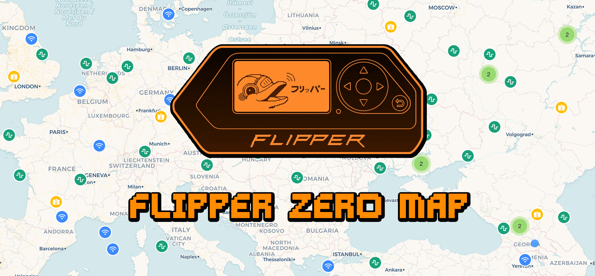

# Flipper Map

Connect your Flipper Zero to your computer using USB and visualize signal recordings on map.

**[↗ flipper-map.stichoza.com](https://flipper-map.stichoza.com)**




Flipper files should include `Latitude:` and `Longitude:` lines. It's done manually at the moment, but I hope there will be an easier way to do it in the future, like automatically saving location at the time of recording using GPS module via GPIO.

You can add location info using Flipper mobile app or directly edit them on SD card.

### Example File

```yaml
Filetype: Flipper SubGhz Key File
Version: 1
Frequency: 433920000
Preset: FuriHalSubGhzPresetOok270Async
Latitude: 41.123456
Longitude: 44.987654
Protocol: Dickert_MAHS
Bit: 36
Key: 00 00 00 0C 12 AB CD EF
```

### Preview


