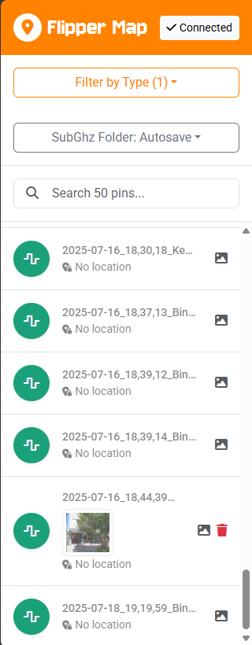
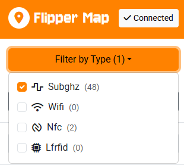

# Flipper Map

Connect your Flipper Zero to your computer using USB and visualize signal recordings on map.

**[↗ flipper-map.stichoza.com](https://flipper-map.stichoza.com)**





Flipper files should include `Lat:` and `Lon:` lines. Custom firmwares like Momentum and RogueMaster automatically add these lines using GPS module (via GPIO). For the official firmware or Unleashed, it should be done manually I hope some day they'll implement same features. You can add location info using Flipper mobile app or directly edit them on SD card.

### Example File

```yaml
Filetype: Flipper SubGhz Key File
Version: 1
Frequency: 433920000
Preset: FuriHalSubGhzPresetOok270Async
Lat: 41.123456
Lon: 44.987654
Protocol: Dickert_MAHS
Bit: 36
Key: 00 00 00 0C 12 AB CD EF
```

### Preview


